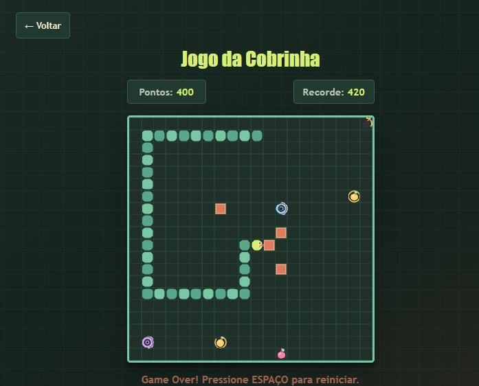

# Snake Game

A browser-based snake game built with vanilla HTML, CSS, and JavaScript. It features a menu, player guide, score tracking, a local high score, and levels with items and obstacles.

Choose between Portuguese (Brazil) and English (United States) from the menu. Your choice is saved in the browser and translates the menu, guide, and in-game messages.

## Run the game

No dependencies or Python are required. Since the game uses JavaScript modules, run it from a local web server rather than opening the file directly:

1. Open the project folder in VS Code.
2. Install the **Live Server** extension.
3. Open `index.html` and click **Go Live** in the status bar, or right-click the file and select **Open with Live Server**.
4. The game will open in your browser.

## Screenshots

### Main menu


### Language selection


### Player guide


### Gameplay 


### Game over



## How to play

- Select **Play** from the menu and use the arrow keys to move the snake.
- Select **Languages** from the menu to switch between Portuguese - BR and English - US.
- Use **← Back** to leave a game and return to the menu; in the guide, use **← Menu** to return.
- Press **Space** to pause; choose a direction to continue.
- Each fruit is worth 10 points and makes the snake grow. Up to three fruits appear on the board, each for 10 seconds.
- The edges wrap around to the opposite sides of the board.
- You lose if you collide with your own body, a bomb, or a moving wall.
- Filling every cell on the board wins the game.

## Phases

| Score | Feature |
| --- | --- |
| 0–99 | Three fruits are available; each disappears after 10 seconds. |
| 100–199 | Bombs appear for up to 8 seconds and may spawn again after disappearing. |
| 200–299 | Two portals transport the snake. They last 15 seconds and reappear in new positions after a short break. |
| 300–399 | A purple potion shrinks the snake by up to five segments. |
| 400–499 | Four moving walls appear in the center of the board and move every 15 seconds. |
| 500+ | Survival: the snake speeds up every 50 points, and features from previous phases remain active. |

## Project structure

```text
.
├── index.html
├── script.js              # JavaScript module entry point
├── css/
│   ├── base.css
│   ├── game.css
│   ├── instructions.css
│   ├── menu.css
│   └── motion.css
└── js/
    ├── config.js          # Game configuration
    ├── game.js            # Gameplay and controls
    ├── level-system.js    # Phases, items, and obstacles
    └── renderer.js        # Canvas rendering
```

Português: [README.pt-BR.md](README.pt-BR.md)
