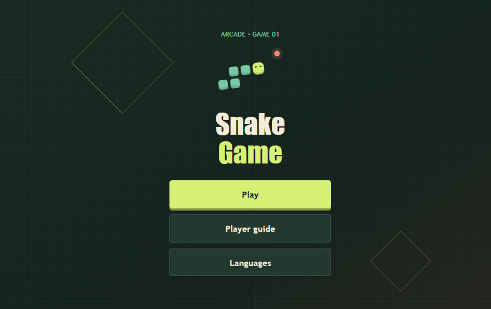
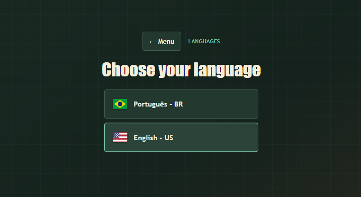
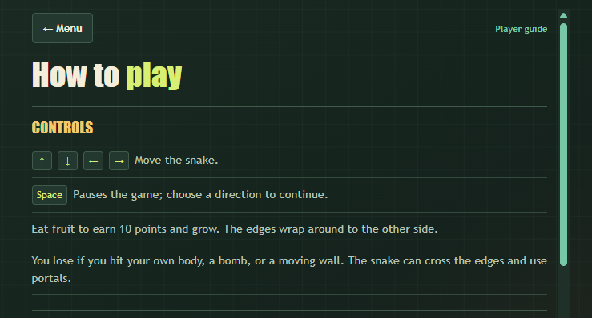
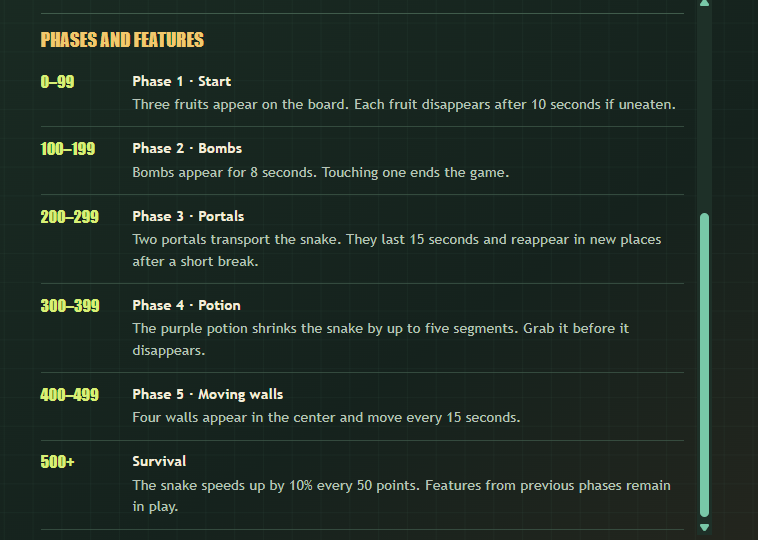
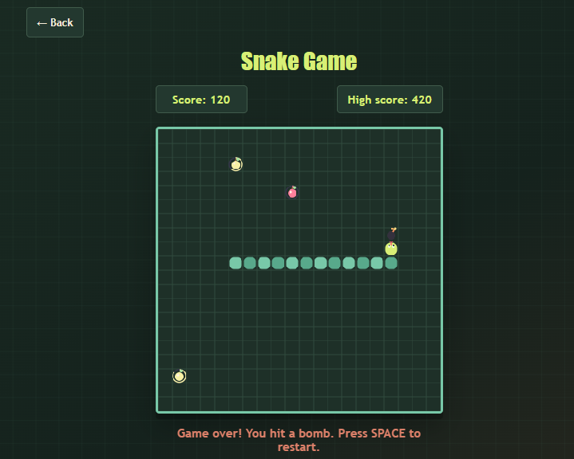

# Snake Game

A browser-based snake game built with vanilla HTML, CSS, and JavaScript. It features a menu, player guide, score tracking, a local high score, and levels with items and obstacles.

Choose between Portuguese (Brazil) and English (United States) from the menu. Your choice is saved in the browser and translates the menu, guide, and in-game messages.

## Run the game

 Since the game uses JavaScript modules, run it from a local web server rather than opening the file directly:

1. Open the project folder in VS Code.
2. Install the **Live Server** extension.
3. Open `index.html` and click **Go Live** in the status bar, or right-click the file and select **Open with Live Server**.
4. The game will open in your browser.

## Screenshots

### Main menu



### Language selection



### Player guide





### Game over




## Project structure

```text
.
├── index.html
├── script.js              # JavaScript module entry point
├── css/
│   ├── base.css
│   ├── game.css
│   ├── i18n.js
│   ├── instructions.css
│   ├── menu.css
│   └── motion.css
└── js/
    ├── config.js          # Game configuration
    ├── game.js            # Gameplay and controls
    ├── level-system.js    # Phases, items, and obstacles
    └── renderer.js        # Canvas rendering
```

Português: [README.pt-BR.md](README.pt-BR.md)
