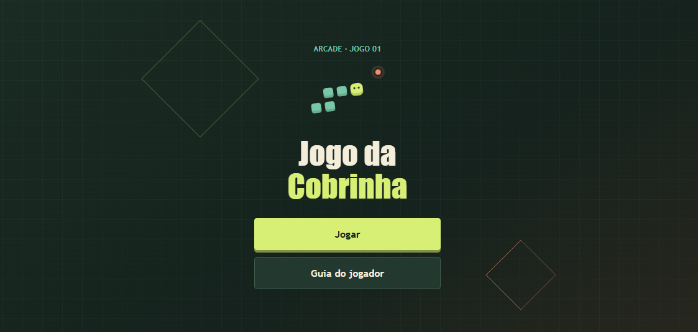
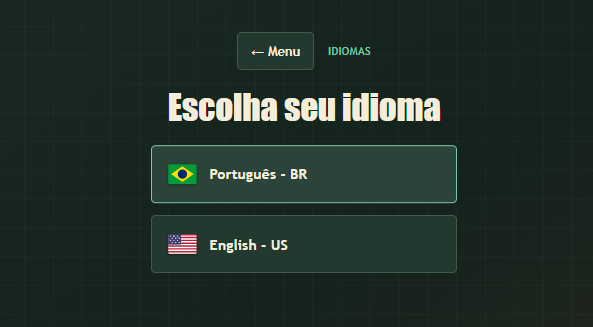
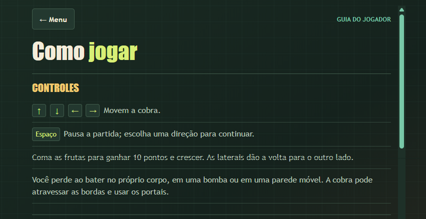
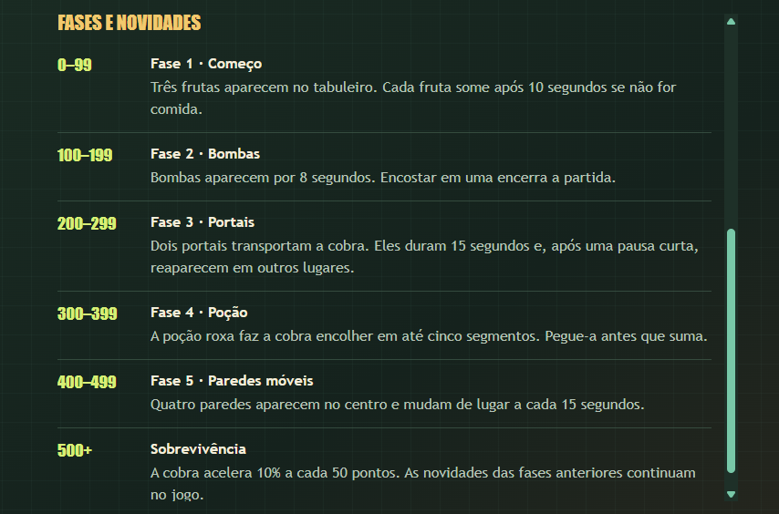
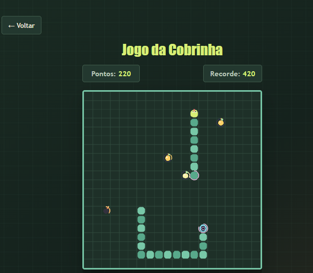

# Jogo da Cobrinha

Jogo de cobrinha para navegador, feito com HTML, CSS e JavaScript nativo. Inclui menu, guia do jogador, pontuação, recorde local e fases com itens e obstáculos.

Escolha entre Português (Brasil) e English (United States) no menu. A preferência fica salva no navegador e traduz o menu, o guia e as mensagens da partida.

## Executar

**[Acesse o site completo aqui]([SEU_LINK_DO_GITHUB_PAGES_AQUI](https://lymm-08.github.io/jogo-da-cobrinha/))**

## Capturas de tela

### Tela inicial



### Troca de idioma



### Guia do jogador





### Partida



### Fim da Partida


## Estrutura do projeto

```text
.
├── index.html
├── script.js             # Entrada dos módulos JavaScript
├── css/
│   ├── base.css
│   ├── game.css
│   ├── i18n.js
│   ├── instructions.css
│   ├── menu.css
│   └── motion.css
└── js/
    ├── config.js          # Configurações do jogo
    ├── game.js            # Partida e controles
    ├── level-system.js    # Fases, itens e obstáculos
    └── renderer.js        # Desenho no canvas
```


English: [README.md](README.md)
